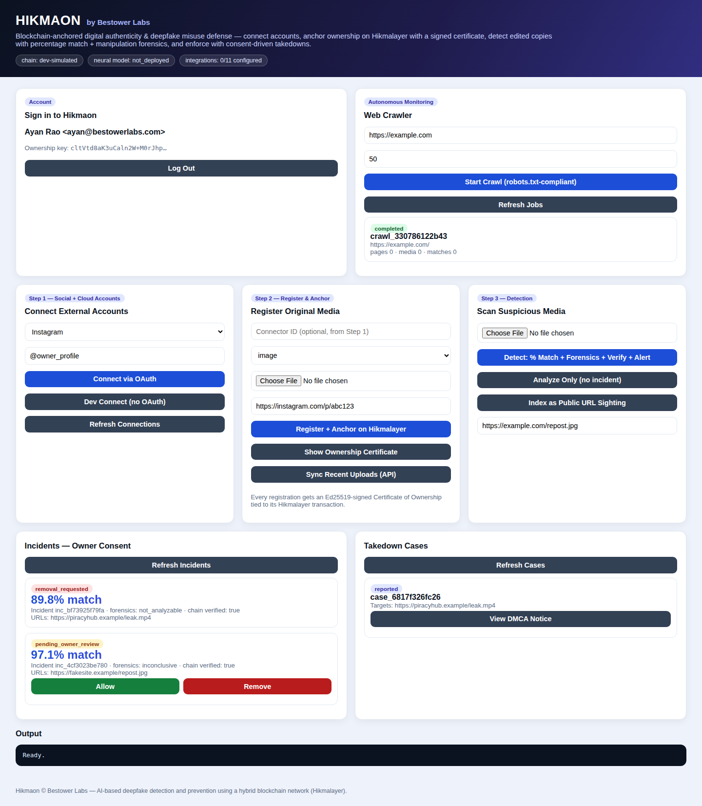

# Hikmaon — by Bestower Labs

Hikmaon is a **blockchain-anchored digital authenticity and deepfake misuse detection & prevention platform**: AI-based deepfake detection and prevention using a hybrid blockchain network (Hikmalayer).



## What it does

1. **Accounts** — modern login/register: Argon2id password hashing, JWT sessions with rotating refresh tokens (reuse detection revokes the session family), login throttling with lockout, and an **Ed25519 ownership keypair issued to every account** so all registrations are cryptographically signed automatically. All owner data is scoped per account.
2. **Connect** — owners link social/cloud accounts (Instagram, Facebook, X, YouTube, TikTok, LinkedIn, Reddit, Google Drive, Dropbox, OneDrive) via real OAuth2 + PKCE flows bound to the logged-in user; uploads flow in through media sync and realtime webhooks.
3. **Anchor** — every media item gets a SHA-256 hash, perceptual fingerprints, and an AI embedding; the proof is anchored on **Hikmalayer** and the owner receives an **Ed25519-signed Certificate of Ownership** anyone can verify.
4. **Detect** — suspicious media is compared perceptually with a **0–100% match score** across all modalities:
   - **Images**: DCT pHash + dHash + visual embeddings (survives re-encode, resize, blur, brightness, moderate crops)
   - **Video**: per-frame perceptual hashing with temporal alignment — re-encoded, downscaled, bitrate-crushed, and *trimmed* copies still match, and the alignment reports where the clip was cut
   - **Audio**: Haitsma–Kalker spectral fingerprinting (the industrial robust-audio-hash design) — MP3/AAC re-encodes, volume changes, and trims match by bit-error-rate; a video's soundtrack is fingerprinted too, so clips match on either channel
   - Manipulation analysis fuses **HikmaonNet** (trainable neural detector) with explainable forensic signals, with honest abstention.
5. **Monitor** — an **autonomous web crawler** (robots.txt-compliant, per-host politeness, SSRF-hardened, domain-scoped) scans seed sites, extracts and fingerprints media, and automatically opens incidents on matches. Run on demand via API/dashboard or on a schedule (`HIKMAON_CRAWLER_SEEDS` + `HIKMAON_CRAWLER_INTERVAL_MINUTES`).
6. **Enforce** — on a confirmed match the owner is alerted and chooses **Allow** or **Remove**; refusal auto-files a DMCA-style takedown case with the blockchain evidence attached, tracked to `removed`/`rejected`.

## Architecture

| Layer | Where | Status |
|---|---|---|
| Perceptual matching (pHash/dHash + embeddings, % score) | `backend/app/perceptual.py` | working, calibrated |
| **Video/audio matching** (frame-hash temporal alignment + Haitsma–Kalker audio fingerprints, ffmpeg-based) | `backend/app/av_fingerprint.py` | working, calibrated |
| **Auth** (Argon2id, JWT + rotating refresh, throttling, per-user Ed25519 keys) | `backend/app/auth.py` | working |
| **Autonomous crawler** (robots.txt, politeness, SSRF guard, auto-incidents) | `backend/app/services/crawler.py` | working |
| Manipulation forensics (ELA, noise, spectrum, metadata) | `backend/app/forensics.py` | working, calibrated |
| **HikmaonNet neural detector** (spatial + frequency + SRM-noise branches, attention fusion) | `backend/ml/` | architecture + full training/eval/export pipeline ready — **train on your GPU cluster** |
| Model serving (ONNX, torch-free) | `backend/app/services/model_serving.py` | working (`HIKMAON_MODEL_PATH`) |
| Hikmalayer client (RPC + retries; chain is a separate project) | `backend/app/hikmalayer.py` | working (`HIKMALAYER_RPC_URL`) |
| Certificates of Ownership (Ed25519) | `backend/app/services/certificate.py` | working |
| Platform OAuth2 + PKCE, encrypted token vault | `backend/app/integrations/oauth.py` | working — activates per provider via credentials |
| Media sync (Graph API, Drive, Dropbox, OneDrive, X) | `backend/app/integrations/sync.py` | implemented against real provider APIs |
| Webhooks (Meta handshake, HMAC verification) | `backend/app/integrations/webhooks.py` | working |
| Consent + takedown workflow | `backend/app/services/takedown.py` | working |
| Dashboard | `frontend/` | working |

## Quick start

```bash
cd backend
python -m venv .venv && source .venv/bin/activate
pip install -r requirements.txt
uvicorn app.main:app --reload           # API on :8000
# open frontend/index.html in a browser
```

Run tests (45 tests: auth, image/video/audio matching, forensics, certificates, crawler, integrations, full lifecycle):

```bash
cd backend && PYTHONPATH=. pytest
```

## Training HikmaonNet (your GPU team)

```bash
pip install -r ml/requirements.txt
python -m ml.train    --manifest /data/manifest.csv --out runs/v1 --epochs 30
python -m ml.evaluate --manifest /data/manifest.csv --checkpoint runs/v1/best.pt --split test --fit-temperature
python -m ml.export   --checkpoint runs/v1/best.pt --out hikmaonnet.onnx
HIKMAON_MODEL_PATH=hikmaonnet.onnx uvicorn app.main:app
```

Manifest format, dataset guidance (FaceForensics++, DFDC, Celeb-DF, diffusion sets), and the cross-generator evaluation discipline are documented in `backend/ml/data.py` and `docs/DEPLOYMENT.md`.

## Documentation

- **`docs/DEPLOYMENT.md`** — full deployment guide: server, model training→serving, Hikmalayer connection, per-platform OAuth activation, production checklist.
- `docs/architecture.md` — technical target architecture.
- `docs/deepfake_detection_assessment.md` — capability assessment and roadmap.
- `docs/development_stages.md` — stage-by-stage build log.
- `docs/Hikmaon Whitepaper v1.1.pdf` — whitepaper.

## Honest scope notes

Deepfake detection is an adversarial race; no system is perfect and anyone claiming 100% is wrong. Hikmaon's design goal is **calibrated accuracy with honest abstention**: percentage scores with explicit thresholds, per-signal explanations in every evidence report, model versions logged for auditability, and `dev-simulated` vs `rpc` chain modes that can never be confused. Audio fingerprinting is strongest on real-world audio (speech/music); spectrally sparse synthetic tones are a known weak case. Remaining production increments: train HikmaonNet on the full dataset mix (pipeline ready), per-platform takedown API submission, per-platform OAuth app registration, and Postgres/vector-DB storage.

---

Hikmaon © Bestower Labs — Inventor: Muhammad Ayan Rao.
